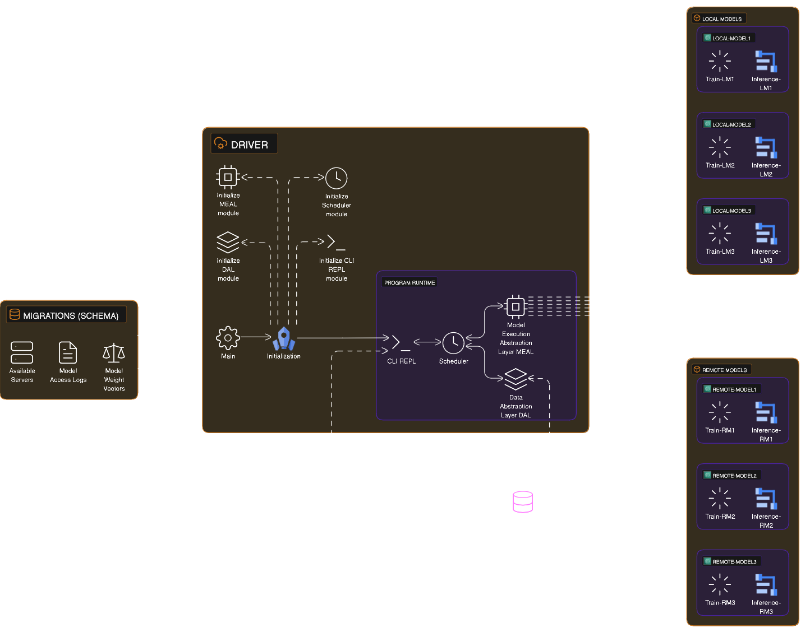
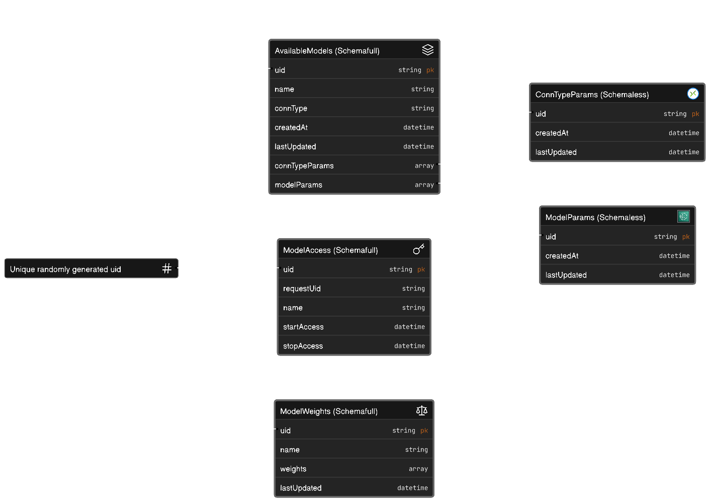

# Model-executor-runtime

## Basic information

Model executor runtime (MER) written in Rust. The project consists of two parts:

- **Migrations**
    - Program that migrates the MER-DB. The DB includes available servers running the different models to tell the driver whether the servers are remot (SSH-connection) or local, model access logs when certain models were used and specific model weight vectors that are used for available models.

- **Driver**
    - Program that primarily runs the CLI application with which we interact (either manually or via external command scheduler). The CLI is connected to different abstraction layers like the Data-Abstraction-Layer (DAL), Model-Executor-Abstraction-Layer (MEAL) and so on.

Available model configurations are written to the DB on migration, they can be changed on runtime via the REPL if the correct command flag is set on starting the driver.


## Program details

### Migrations program

The migrations program generaly just executes the migrations on a database. It followis the principle of checking if a `Migratons` table exist and checks the last number of the migration executed. Depending on the above two conditions it either creates a new `Migrations` table and executes the migration script numbers that were not yet executed.

### Driver program

The driver program first initializes the following modules:

- **REPL module**
    - Creates the CLI for the user to interact with.

- **DAL module**
    - Creates the Data Access layer through which we can access the data in the database in a consise and structured manner, used for fetching the available local/remote models at the begginging of the program, interaction with the database on model access and updating model weights. The DAL module is comprised of:
        - `mod.rs` - Abstarction layer that handels different database drivers and returns the before specified type of the driver
        - `surreal.rs` - Driver for the Surreal database (TODO)
        - `postgres.rs` - Driver for the Postgres database (TODO)

- **MEAL module**
    - Creates a Model Execution abstraction Layer through which we can execute either local/remote models. The MEAL module is comprised of:
        - `mod.rs` - Abstraction layer for model execution
        - `local.rs` - Driver for the local execution of the models using the standard pipes for communication
        - `ssh.rs` - Driver for the remote execution of models via SSH protocol for connection and standard pipes for communication


## Project structure

These are the relevant folders within the project:

- **migrations (Rust project)**
    - `sql` - Folder with all SQL migration scripts. The format in which the scripts should be named is: ```XX-NameOfTheScript.sql```, where:
        - `XX` -  The consecutive number of the migration, for example 00, 01, 02, 03, ...
        - `NameOfTheScript` - The name of the migration script, usually something meaningfull. The file should always end with the `.sql` file type if not the script won't execute it.
    - `src/main.rs` - The rust migration script of the project
    - `target` - Automaticaly generated folder using cargo build for rust binaries
    - `Cargo.lock` - Cargo file that keeps the list of locked packages and their remote sources
    - `Cargo.toml` - Cargo file that specifies which versions of packages that should be used
    - `Dockerfile` - Multistage build docker-file that runs the migrations in a custom small size container (Not really relevant for migrations, but maybe more so for the driver)

- **driver (Rust project)**
    - `src/main.rs` - The rust driver script which initializes and uses all the submodules like: repl, dal, meal and so on...
    - `target` - Automaticaly generated folder using cargo build for rust binaries
    - `Cargo.lock` - Cargo file that keeps the list of locked packages and their remote sources
    - `Cargo.toml` - Cargo file that specifies which versions of packages that should be used
    - `Dockerfile` - Multistage build docker-file that runs the driver in a custom small size container

- **startStopScripts (Automation bash scripts)**
    - `startMER.sh` - Script that starts the MER DB, runs the migrations binary and runs the driver binary
    - `stopMER.sh` - Script that stops the MER DB and driver
    - `testDriver.sh` - Script that only runs the driver binary

- **.env**
    - Example environment variables configuration file for this project

- **docker-compose.yaml**
    - Docker-compose file for the SurrealDB





## Database schema

### SurrealDB

The schema of the SurrealDB takes advantage of creating a schemafull and schemaless tables where the parameters that may be varied (more or less of them for model execution specifics) are corespondingly saved in the schemaless table and the static fields are saved in the schemafull table. The elements are linked by itself using a uniquely generated UID, which is defined with the native DB functions.

